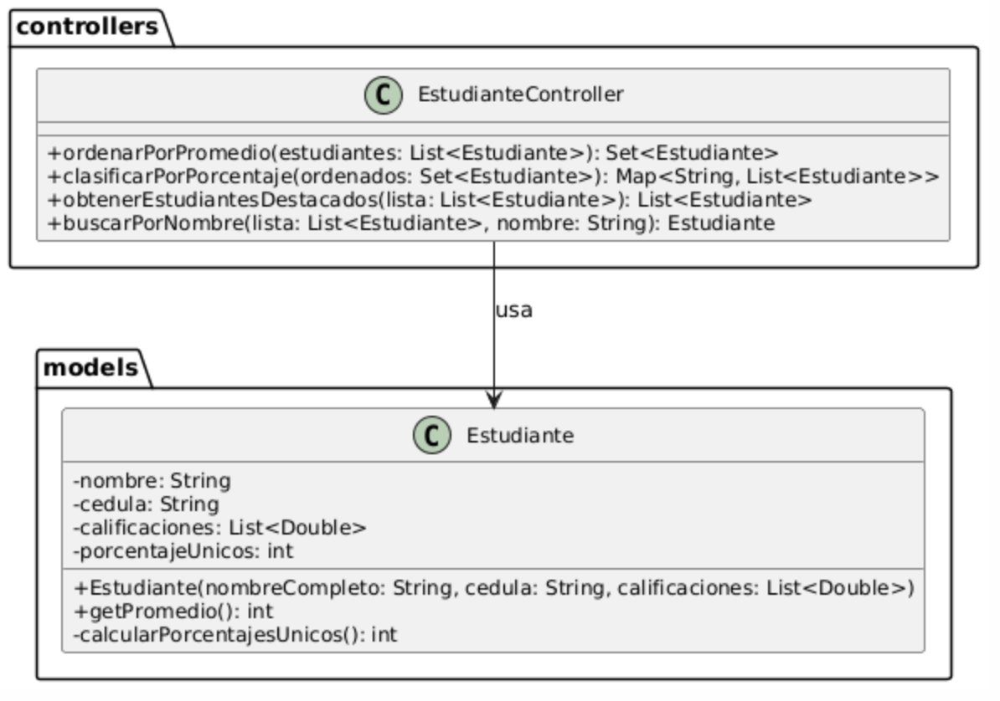

# Examen Práctico

---

## 📄 Descripción General

En un contexto académico, se requiere implementar una solución para gestionar un conjunto de estudiantes con funcionalidades que permitan:

* Filtrar y ordenar estudiantes según su rendimiento promedio.
* Clasificar a los estudiantes según la diversidad de caracteres en su nombre.
* Identificar estudiantes destacados.
* Realizar búsquedas eficientes por nombre.

Estas operaciones simulan procesos de evaluación y clasificación en entornos educativos reales.

---



## 🎓 Modelo: `Estudiante`

Cada objeto `Estudiante` contiene:

* `nombre`: Nombre completo.
* `cedula`: Identificador único.
* `calificaciones`: Lista de 6 calificaciones (double) de 0 a 10.

### Campos Calculados:

* `promedio`: Promedio entero de las 6 calificaciones.
* `porcentajeUnicos`: Porcentaje de caracteres únicos en el nombre sin espacios.

Ejemplo:

```java
Nombre: "Luis Luis"
Caracteres sin espacios: "luisluis"
Caracteres únicos: {l, u, i, s} (4)
Porcentaje: 4 * 100 / 8 = 50%
```

---

## 💡 Clase a implementar: `EstudianteController`

### Método A – `ordenarPorPromedio(List<Estudiante>)`

* Retorna un `TreeSet<Estudiante>`.
* Ordena por:

  * Promedio (descendente)
  * Nombre (ascendente)
  * Cédula (ascendente)
* Si la cédula ya está en el conjunto, **no se agrega** aunque los otros campos sean distintos.

### Método B – `clasificarPorPorcentaje(Set<Estudiante>)`
* La entrada es un `Set<Estudiante>` ordenado por el método A.
* Retorna un `Map<String, List<Estudiante>>` donde:
  * La clave es una letra (A, B, C, D, E) según el porcentaje de caracteres únicos.
  * El valor es una lista de estudiantes (`LinkedList`) que cumplen con ese porcentaje.
* Agrupa estudiantes en un `Map<String, List<Estudiante>>` según el campo `porcentajeUnicos`:
* Los rangos de porcentaje son:

| Rango de Porcentaje | Categoría |
| ------------------- | --------- |
| 90 - 100            | A         |
| 70 - 89             | B         |
| 50 - 69             | C         |
| 30 - 49             | D         |
| 0  - 29             | E         |

* El orden en cada lista debe respetar el orden de entrada (usa `LinkedList`).

### Método C – `obtenerEstudiantesDestacados(List<Estudiante>)`

* Filtra estudiantes con promedio > 7.0.
* Retorna lista ordenada por nombre ascendente.
* Si no hay estudiantes destacados, retorna una lista vacía.

### Método D – `buscarPorNombre(List<Estudiante>, String)`

* Busca un estudiante por nombre en una lista ordenada que fue **previamente ordenada por nombre** en el Método C.
* Busca en una lista ordenada por nombre usando **búsqueda binaria**.
* Retorna el estudiante correspondiente o `null`.

---

## 📊 Ejemplo de Ejecución (con `crearEstudiantes()`) donde se tiene el siguiente listado inicial

```java
List<Estudiante> estudiantes = Arrays.asList(
                new Estudiante("Ana Torres", "0101010101", Arrays.asList(8.5, 9.0, 7.5, 10.0, 9.5, 8.0)),
                new Estudiante("Luis Luis", "0202020202", Arrays.asList(6.0, 7.5, 8.0, 6.5, 7.0, 6.0)),
                new Estudiante("Camila Vera", "0303030303", Arrays.asList(10.0, 10.0, 10.0, 9.5, 9.0, 9.5)),
                new Estudiante("Marco Luis Luis", "0202020202", Arrays.asList(8.0, 7.5, 9.0, 8.5, 7.0, 8.0)), // Cedula
                // repetida
                new Estudiante("Elena Ruiz", "0404040404", Arrays.asList(5.0, 1.0, 4.5, 6.0, 5.5, 6.5)),
                new Estudiante("Carlos Díaz", "0505050505", Arrays.asList(9.5, 1.0, 3.5, 10.0, 10.0, 10.0)),
                new Estudiante("Luis  Luis Luis Luis", "0606060606",
                        Arrays.asList(1.0, 2.0, 7.0, 1.0, 7.0, 7.0)),
                new Estudiante("Luis  Luis Luis Luis", "0606060602",
                        Arrays.asList(1.0, 2.0, 7.0, 1.0, 7.0, 7.0)),
                new Estudiante("Luis  Luis Luis Luis", "0606060603",
                        Arrays.asList(1.0, 2.0, 7.0, 1.0, 7.0, 7.0)),
                new Estudiante("Luis  Luis Luis Luis", "0606060604",
                        Arrays.asList(1.0, 2.0, 7.0, 3.0, 7.0, 7.0)),
                new Estudiante("Luis  Luis Luis Luis", "0606060605",
                        Arrays.asList(5.0, 2.0, 7.0, 5.0, 7.0, 7.0)));
```
Salida esperada del listado original con los campos calculados:

```java
1.- Ana Torres (0101010101) Porcentaje de caracteres únicos: 77%, Promedio: 8
2.- Luis Luis (0202020202) Porcentaje de caracteres únicos: 50%, Promedio: 6
3.- Camila Vera (0303030303) Porcentaje de caracteres únicos: 80%, Promedio: 9
4.- Marco Luis Luis (0202020202) Porcentaje de caracteres únicos: 69%, Promedio: 7
5.- Elena Ruiz (0404040404) Porcentaje de caracteres únicos: 88%, Promedio: 4
6.- Carlos Díaz (0505050505) Porcentaje de caracteres únicos: 90%, Promedio: 7
7.- Luis  Luis Luis Luis (0606060606) Porcentaje de caracteres únicos: 25%, Promedio: 4
8.- Luis  Luis Luis Luis (0606060602) Porcentaje de caracteres únicos: 25%, Promedio: 4
9.- Luis  Luis Luis Luis (0606060603) Porcentaje de caracteres únicos: 25%, Promedio: 4
10.- Luis  Luis Luis Luis (0606060604) Porcentaje de caracteres únicos: 25%, Promedio: 4
11.- Luis  Luis Luis Luis (0606060605) Porcentaje de caracteres únicos: 25%, Promedio: 5
```

## 📝 Resultado de Ejecución del controllador

```java
Estudiantes ordenados por promedio (desc), nombre(asc), cédula (asc); (sin repetir cédulas):
1.- Camila Vera - Porcentaje: 80%, Promedio: 9
2.- Ana Torres - Porcentaje: 77%, Promedio: 8
3.- Carlos Díaz - Porcentaje: 90%, Promedio: 7
4.- Luis Luis - Porcentaje: 50%, Promedio: 6
5.- Luis  Luis Luis Luis - Porcentaje: 25%, Promedio: 5
6.- Elena Ruiz - Porcentaje: 88%, Promedio: 4
7.- Luis  Luis Luis Luis - Porcentaje: 25%, Promedio: 4
8.- Luis  Luis Luis Luis - Porcentaje: 25%, Promedio: 4
9.- Luis  Luis Luis Luis - Porcentaje: 25%, Promedio: 4
10.- Luis  Luis Luis Luis - Porcentaje: 25%, Promedio: 4
```
 Se eliminaron duplicados por cédula.

```java

Clasificación por porcentaje de caracteres únicos:
- Categoría A: [ Carlos Díaz;  ]
- Categoría B: [ Camila Vera;  Ana Torres;  Elena Ruiz;  ]
- Categoría C: [ Luis Luis;  ]
- Categoría D: [  ]
- Categoría E: [ Luis Luis Luis; (x5) ]
```


```java
Estudiantes destacados (promedio > 7):
- Ana Torres
- Camila Vera
```

```java
Estdiante busado por nombre "Camila Vera":
Estudiante encontrado: Camila Vera (0303030303) Porcentaje de caracteres únicos: 80%, Promedio: 9
```

---

## 📆 RÚBRICA DE EVALUACIÓN (9 puntos)
| **Componente Evaluado**                      | **Descripción**                                                                                                                                             | **Puntos** |
| -------------------------------------------- | ----------------------------------------------------------------------------------------------------------------------------------------------------------- | ---------- |
| ✅ Campo calculado: `porcentajeUnicos`        | Calcula correctamente el porcentaje de caracteres únicos del nombre (sin espacios, ignorando mayúsculas).                                                   | 3.0        |
| ✅ Campo calculado: `promedio`                | Calcula correctamente el promedio entero (sin decimales) de las 6 calificaciones.                                                                           | 3.0        |
| 🔷 Método A – `ordenarPorPromedio`           | Ordena correctamente el `TreeSet` de forma descendente por promedio, luego nombre, luego cédula. Elimina duplicados por cédula.                             | 6.0        |
| 🔷 Método B – `clasificarPorPorcentaje`      | Agrupa correctamente en un `Map<String, List<Estudiante>>` usando letras A–E según rangos de porcentaje. Conserva el orden del TreeSet usando `LinkedList`. | 6.0        |
| 🔷 Método C – `obtenerEstudiantesDestacados` | Filtra correctamente los estudiantes con promedio > 7.0, y los ordena por nombre.                                                                           | 5.0        |
| 🔷 Método D – `buscarPorNombre`              | Implementa búsqueda binaria correctamente sobre lista ordenada por nombre.                                                                                  | 4.0        |
| 🖨️ Impresiones esperadas en consola         | Se imprime correctamente el resultado de cada método de forma ordenada y comprensible (por ejemplo: título antes de cada bloque).                           | 3.0        |
| 💯 **Total**                                 | | **30.0**   |

---

## 💼 Validación Automática

La evaluación automática ejecutará pruebas unitarias para validar:

* Cálculo de campos `promedio` y `porcentajeUnicos`
* Comportamiento esperado de cada método (A, B, C, D)
* Correcta manipulación de estructuras: `TreeSet`, `Map`, `List`

---

**⚠️ Importante**: Asegúrate de que tu método `compare(...)` en el `TreeSet` respete la unicidad por cédula. De lo contrario, los datos duplicados no serán eliminados correctamente y se penalizará.

---


javac --release 17 -cp "lib/*" -d bin src/validaciones/ValidTest.java src/models/Estudiante.java
jar cf lib/validadores-evaluacion.jar -C bin validaciones -C bin models
jar tf lib/validadores-evaluacion.jar